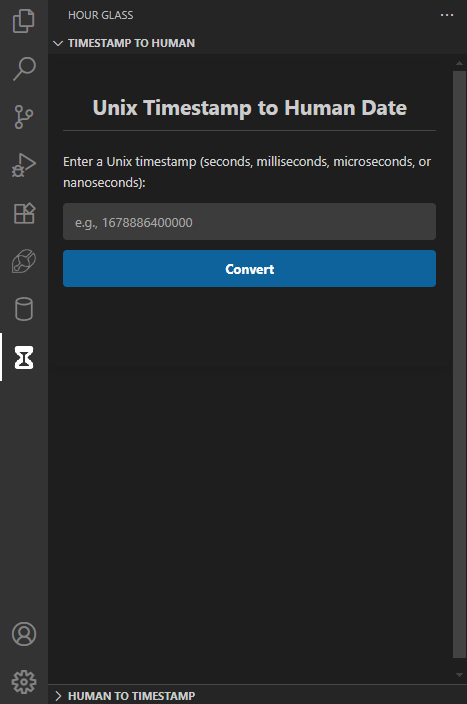

# Hour Glass
---
It's a Visual Studio Code Extension that's inspired from the great website [EpochConverter](https://www.epochconverter.com). Over the years of my programming journey, I've come across various occations where I had to handle date and time and the most convinient way has always been by converting date and time into a unix timestamp. But always having to switch windows to use it was very troublesome. So I made this extension.

## Features

Time to talk about the only two and the best features of this extension.

**Timestamp**

As shown in the image, you can enter a Unix timestamp and get it converted into human readable format.

## Known Issues

Currently, the GMT section of Human Date to Timestamp part is not working

### 1.0.0

Initial release of Hour Glass

_Credits_

Icon was downloaded from Icons8.com